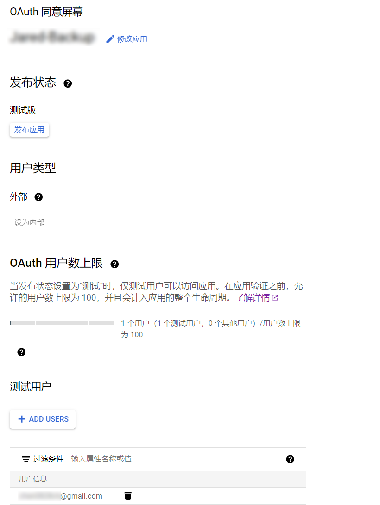
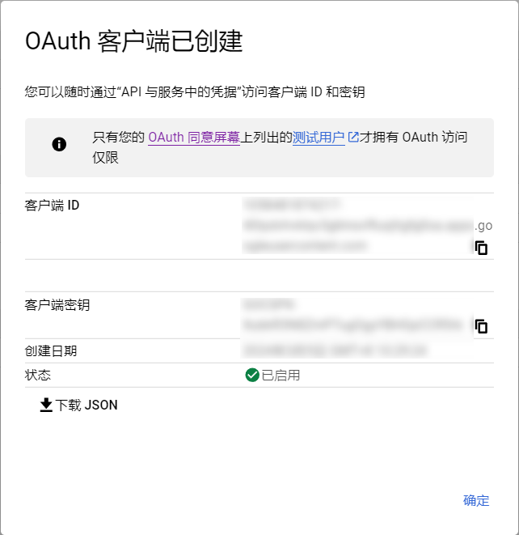

# Google Drive 自动备份脚本

## :zap: 亮点
- 低依赖，低代码
- 灵活配置，流程清晰

## :loudspeaker: 更新日志
[CHANGELOG](CHANGELOG.md)

## :seedling: 环境配置
1. 创建 python 虚拟环境：
    ```
    mkdir /home/auto-backup
    cd /home/auto-backup
    python3 -m venv .
    source /home/auto-backup/bin/activate
    ```
2. 安装依赖：
    ```
    pip install PyDrive2
    ```
3. 代码部署：将 `gd_backup.py` 和 `gd_conf.ini` 放置到目录下
    ```
    wget https://raw.githubusercontent.com/Jared-02/auto-backup/main/gd_backup.py
    wget https://raw.githubusercontent.com/Jared-02/auto-backup/main/gd_conf.ini
    ```

## :key: 获取访问凭据
1. 到[控制面板](https://console.cloud.google.com/apis/dashboard)启用 Google Drive API

2. 创建 [OAuth 同意屏幕](https://console.cloud.google.com/apis/credentials/consent)：
    用户类型选择**外部**，添加测试用户

    如果你要部署长期自动化，请点击 `发布应用` 为正式版。否则[刷新令牌有效期过短](https://github.com/Jared-02/auto-backup/issues/1)，你需要频繁进行授权以更新令牌。

    

3. 创建应用授权凭据

    [创建凭据](https://console.cloud.google.com/apis/credentials) > OAuth 客户端 ID > 应用类型 > Web 应用

    已获授权的重定向 URI：`http://localhost:8080/`

4. 下载 OAuth 客户端：下载 JSON > 文件另存为 `client_secrets.json` > 保存到工作目录下
    

## :file_folder: 创建备份目录

1. 在 Google Drive [根目录](https://drive.google.com/drive/my-drive)创建一个新文件夹

2. 打开新建的文件夹，复制 URL 中的文件夹 ID，如 `https://drive.google.com/drive/folders/<FolderID>` 中的 `<FolderID>`

3. 将文件夹名和文件夹 ID 填写到 `gd_conf.ini` 中的*云端备份存放目录*

4. 请确认 `gd_conf.ini` 中的配置项填写完毕，并将 `client_secrets.json` 置于相同工作目录下，再进行下一步。

## :calendar: 自动化备份

1. **首次备份请手动执行**，交互式保存凭据，以下在虚拟环境下运行：
    ```
    # cd /home/auto-backup
    # source /home/auto-backup/bin/activate
    (auto-backup) # python gd_backup.py 
    ```
    如果你的脚本运行环境在远程服务器，你需要通过 SSH 隧道转发本地端口以完成重定向验证：
    ```
    ssh -L 8080:localhost:8080 root@8.8.8.8 -N
    ```
    *如果使用密钥登录：*
    ```
    ssh -i path/to/key -L 8080:localhost:8080 root@8.8.8.8 -N
    ```
    退出虚拟环境：
    ```
    deactivate
    ```

2. 查看备份历史记录，依据你在 `gd_conf.ini` 中的 `store_backup_path` 配置，日志文件在该目录中的 `.log` 路径下：
    ```
    # ls -l /home/example-path/.log
    -rw-r--r-- 1 root root  894 Mar  5 04:00 history.json
    -rw-r--r-- 1 root root 2787 Mar  5 04:00 run.log

    # jq '.' /home/example-path/.log/history.json
    ...
    # tail /home/example-path/.log/run.log
    ...
    ```
    **请不要随意修改持久化记录！**

3. 每日自动备份（依赖哪吒面板计划任务，可提供通知功能）：

    1. 将以下内容写入 `run.sh` 存放到工作目录：
        ```bash
        #!/bin/bash
        source /home/auto-backup/bin/activate
        python '/home/auto-backup/gd_backup.py'
        ```

    2. 哪吒面板：任务 > 新增计划任务
        - 名称：自动备份
        - 任务类型：**计划任务**
        - 计划：`0 0 4 * * *`（示例：每日 4 时备份）
        - 命令：`cd /home/auto-backup && ./run.sh`

4. 每日自动备份（无依赖）：

    1. 将以下内容写入 `run.sh` 存放到工作目录：
        ```bash
        #!/bin/bash
        source /home/auto-backup/bin/activate
        python '/home/auto-backup/gd_backup.py'
        ```

    2. 创建系统级 cron 任务（示例：每日 4 时备份）
        ```
        # vim /etc/cron.d/auto-backup

        0 4 * * * root cd /home/auto-backup && "./run.sh" > /dev/null 2>&1
        ```
    3. 重载 cron
        ```
        /etc/init.d/cron reload
        service cron status
        ```